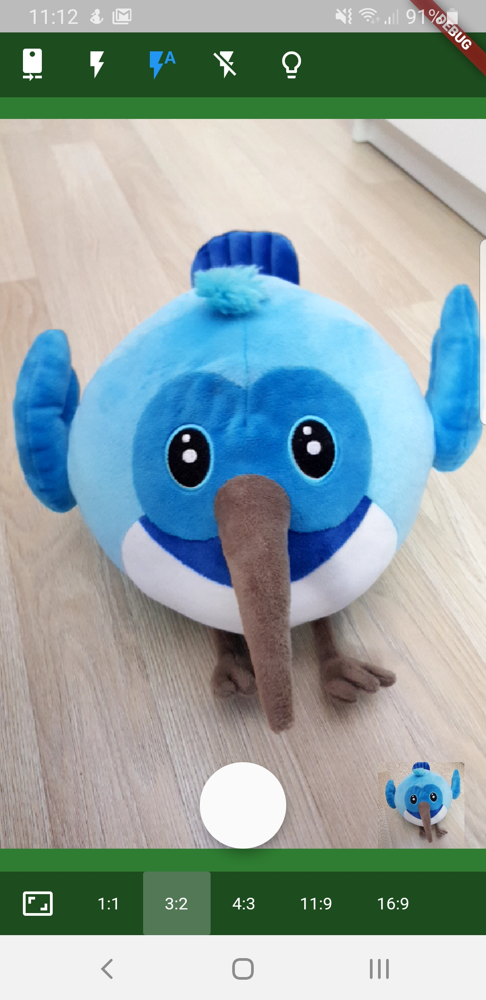

# native_camera

This is a POC of [react-native-camera](https://github.com/react-native-community/react-native-camera) library port to Flutter.

**Warning!** 

This is highly experimental plugin and may not work on your device. Currently, only Android is supported.

## Getting Started

To see how it works run the example from the main2.dart file:

`flutter run -t lib/main2.dart`

It may be necessary to install the app, enable the camera permission, and run again.

| Android preview | iOS |
|---|---|
|  | n/a |